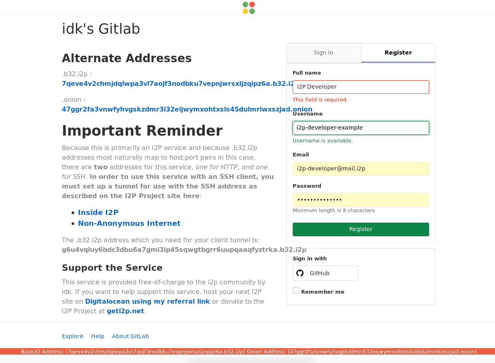

Git over I2P for Users
======================

TUTORIAL for setting up git access through an I2P Tunnel. This tunnel will act
as your access point to a single git service on I2P.

This **NOT** git-remote-i2p, I'm working on it, it'll be ready soon.
git-remote-i2p will automatically tunnel to a git service hosted at an I2P
domain or at a .b32.i2p address.

Before anything else: Know the capabilities the service offers to the public
----------------------------------------------------------------------------

Depending on how the git service is configured, it may or may not offer all
services on the same address. In the case of gittest.i2p, there is a public
HTTP URL, but this URL is read-only and cannot be used to make changes. To do
that, you must also know the SSH base32, which isn't public at this time. Unless
I've told you the SSH base32 to gittest.i2p, head over to the [Server](GITLAB.md)
tutorial to set up your own.

First: Set up an account at a Git service
-----------------------------------------

To create your repositories on a remote git service, sign up for a user account
at that service. Of course it's also possible to create repositories locally
and push them to a remote git service, but most will require an account and for
you to create a space for the repository on the server. Gitlab has a very simple
sign-up form:

Second: Create a project to test with
-------------------------------------

To make sure the setup process works, it helps to make a repository to test with
from the server, and for the sake of this tutorial, we're going to use a fork of
the I2P router. First, browse to the i2p-hackers/i2p.i2p repository:

Then, fork it to your account.

Third: Set up your git client tunnel
------------------------------------

