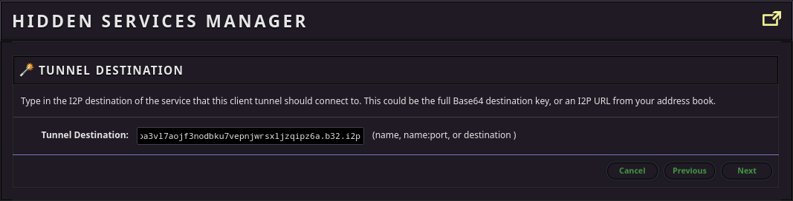
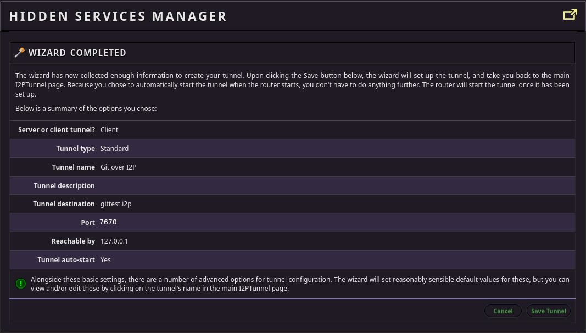

Git over I2P for Users
======================

TUTORIAL for setting up git access through an I2P Tunnel. This tunnel will act
as your access point to a single git service on I2P.

This **NOT** git-remote-i2p, I'm working on it, it'll be ready soon.
git-remote-i2p will automatically tunnel to a git service hosted at an I2P
domain or at a .b32.i2p address.

Before anything else: Know the capabilities the service offers to the public
----------------------------------------------------------------------------

Depending on how the git service is configured, it may or may not offer all
services on the same address. In the case of gittest.i2p, there is a public
HTTP URL, but this URL is read-only and cannot be used to make changes. To do
that, you must also know the SSH base32, which isn't public at this time. Unless
I've told you the SSH base32 to gittest.i2p, head over to the [Server](GITLAB.md)
tutorial to set up your own.

First: Set up an account at a Git service
-----------------------------------------

To create your repositories on a remote git service, sign up for a user account
at that service. Of course it's also possible to create repositories locally
and push them to a remote git service, but most will require an account and for
you to create a space for the repository on the server. Gitlab has a very simple
sign-up form:

Second: Create a project to test with
-------------------------------------

To make sure the setup process works, it helps to make a repository to test with
from the server, and for the sake of this tutorial, we're going to use a fork of
the I2P router. First, browse to the i2p-hackers/i2p.i2p repository:

Then, fork it to your account.

Third: Set up your git client tunnel
------------------------------------

To have read-write access to my server, you'll need to set up a tunnel for your
SSH client. As an example, we're going to use the HTTP tunnel instead, but if
all you need is read-only, HTTP/S cloning, then you can skip all this and just
use the http_proxy environment variable to configure git to use the
pre-configured I2P HTTP Proxy. For example:

        http_proxy=http://localhost:4444 git clone http://gittest.i2p/welshlyluvah1967/i2p.i2p

Then, add the address you will be pushing and pulling from. Note that this
example address is for Read-Only HTTP-over-I2P clones, if your admin does not
allow the git HTTP(Smart HTTP) protocol, then you will need to get the SSH clone
base32 from them. If you have an SSH clone base32, substitute it for the base32
in this step, which will fail.

Pick a port to forward the I2P service to locally.

I use it alot, so I start my client tunnel automatically, but it's up to you.

When you're all done, it should look alot like this.

Fourth: Attempt a clone
-----------------------

Now your tunnel is all set up, you can attempt a clone over SSH.

        GIT_SSH_COMMAND="ssh -p 7442" \
            git clone git@127.0.0.1:welshlyluvah1967/i2p.i2p

You might get an error where the remote end hangs up unexpectedly.
Unfortunately git still doesn't support resumable cloning. Until it does, there
are a couple fairly easy ways to handle this. The first and easiest is to try
and clone to a shallow depth:

        GIT_SSH_COMMAND="ssh -p 7442" \
            git clone --depth 1 git@127.0.0.1:welshlyluvah1967/i2p.i2p

Once you've performed a shallow clone, you can fetch the rest resumably by
changing to the repo directory and running:

        git fetch --unshallow

At this point, you still don't have all your branches yet. You can get them by
running the following commands:

        git config remote.origin.fetch "+refs/heads/*:refs/remotes/origin/*"
        git fetch origin

Which tells git to alter the repository configuration so that fetching from
origin fetches all branches.

If that doesn't work, then the next easy thing to try is to decrease the tunnel
length. Don't do this if you believe you are at risk of your code-contribution
activity being de-anonymized by a well-resourced attacker seeking to run
malicious nodes and control your whole path. If that is you, thanks for
contributing code under such staggeringly dangerous conditions, I really found
what you did in 2013 to be an inspiration and hope you are exonerated by a fair
trial conducted in absentia.

